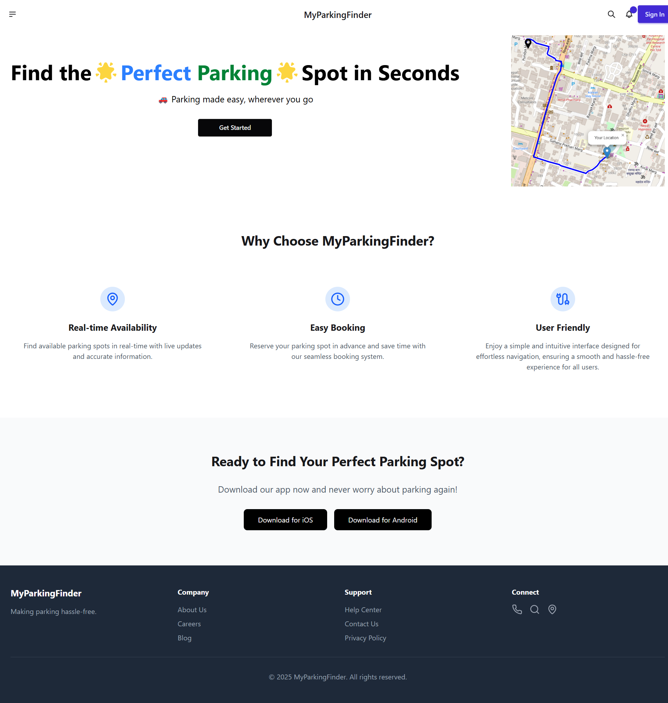
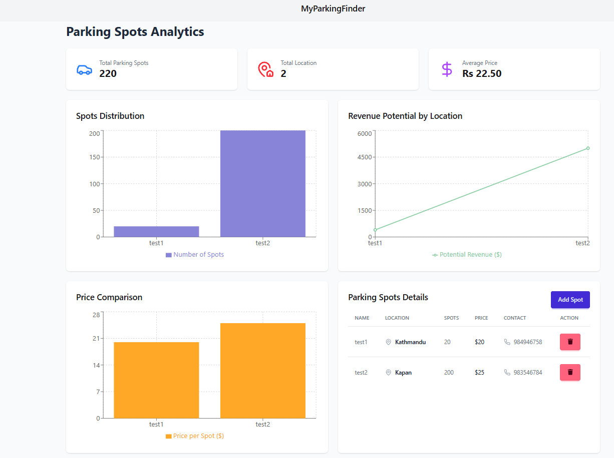
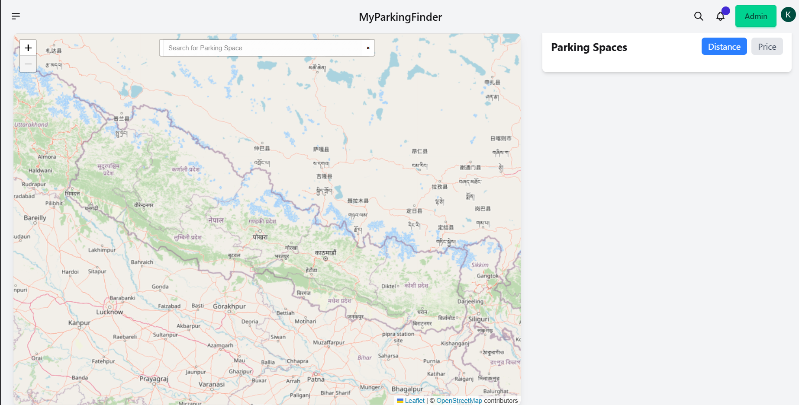
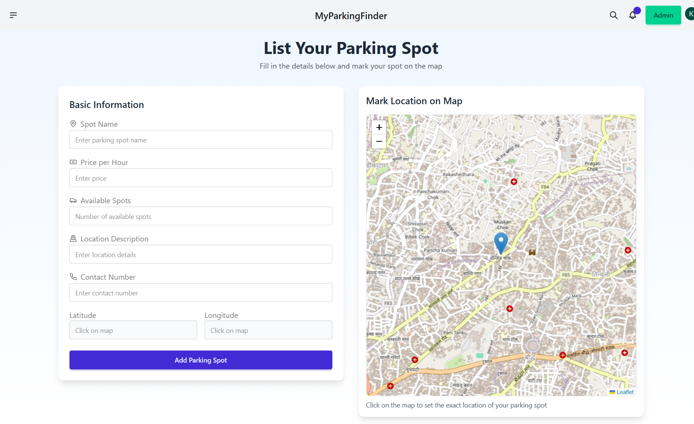

# MyParkingFinder

Welcome to ***MyParkingFinder*** is a web-based parking finder system that helps users locate nearby parking areas with an intuitive map-based UI similar to Uber/InDrive. The frontend is built using React.js, while the backend is powered by Laravel, serving as an API.

---
## Feature
🗺️ **Interactive Map** - View nearby parking spots using Leaflet.

**🚗 Real-time Navigation** - Routing support with turn-by-turn navigation.

**🔐 Secure Authentication** - User authentication with Clerk.

**📍 Search & Geolocation** - Find parking spots based on your current location.

**📊 User-Friendly UI** - Designed with Tailwind CSS and DaisyUI for a seamless experience.

**📡 REST API Integration** - Laravel backend serving data efficiently.

---

## Table of Contents
- [Tech Stack](#tech-stack)
- [Authentication](#authentication)
- [Design Tools](#design-tools)
- [Screenshots](#screenshots)
- [Installation](#installation)
- [Contributing](#contributing)
- [License](#license)


---

## Tech Stack
- **Frontend**: React
- **Backend**: Laravel
- **Languages**: JavaScript, PHP
- **Styling**: Tailwind CSS, DaisyUI
- **Mapping**: Leaflet

---
## Authentication
Authentication is handled using **Clerk** (`@clerk/clerk-react`), providing a secure and user-friendly solution for sign-up, login, and user management.

---

## Design Tools
- **Tailwind CSS**: A utility-first CSS framework for rapid and responsive design.
- **DaisyUI**: A component library built on Tailwind CSS, offering pre-designed UI elements.
- **FontAwesome**: Used for scalable vector icons across the app.
- **Lucide**: Additional icon set for modern and clean visuals.
- **React Icons**: A collection of popular icon packs for React.

---

## Screenshots
Below are some screenshots of MyParkingFinder in action. (Add your screenshots here!)

### Landing Page


### Dashboard


### User Page


### Add Spot


---

## Installation
To run MyParkingFinder locally, follow these steps:

**Frontend Setup**
1. **Clone the repository**:
   ```bash
   git clone https://github.com/yourusername/myparkingfinder.git
   cd MyParkingFinder
2. **Install Dependencies**
    ```bash
    npm install
3. **Start the development Server**
    ```bash
    npm run dev
4. **Navigate to http://localhost:5173 to use the app.**

**Backend Setup(Laravel)**

1. **Install dependencies**:
    ```bash
    composer install

2. **Set up .env file and configure database.**

3. **Run migrations:**
    ```bash
    php artisan migrate

4. **Start Laravel server:**
    ```bash
    php artisan serve